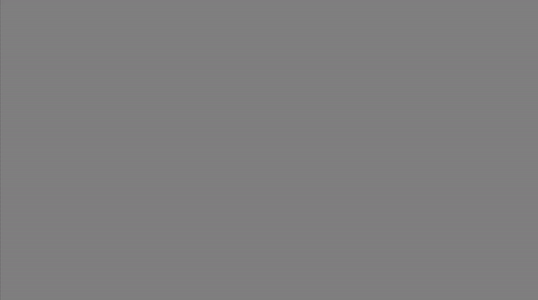

# slabes

A compiled language for Simulating LAByrinth EScape

is a domain specific esoteric programming language made for fun of a language developer and pain of the language user.

## Intsall

You need a c compiler and a python interpreter.

```bash
make install
```

### for msys

```bash
pacman -S mingw-libltdl
```

or `mingw-w64-clang-x86_64-libltdl` or any other specific one

## Preview

Generation of a maze:



Recursive fibonacci:

```
big fib   big number   begin
    check number <= 0 do re 0 .,
    check number == 1 do retu 1 .,
    retur fib(number - 1) + fib(number - 2),
. end,
```

To compile, run `python -m slabes yourfile.sl -o yourbinary.o`

And oh yeah, it has some cursed lexing and grammar rules 😈

And don't mind the base32 integer literals, so `1HT` means `1597`
Have fun!
